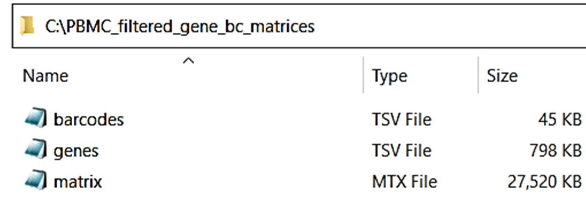
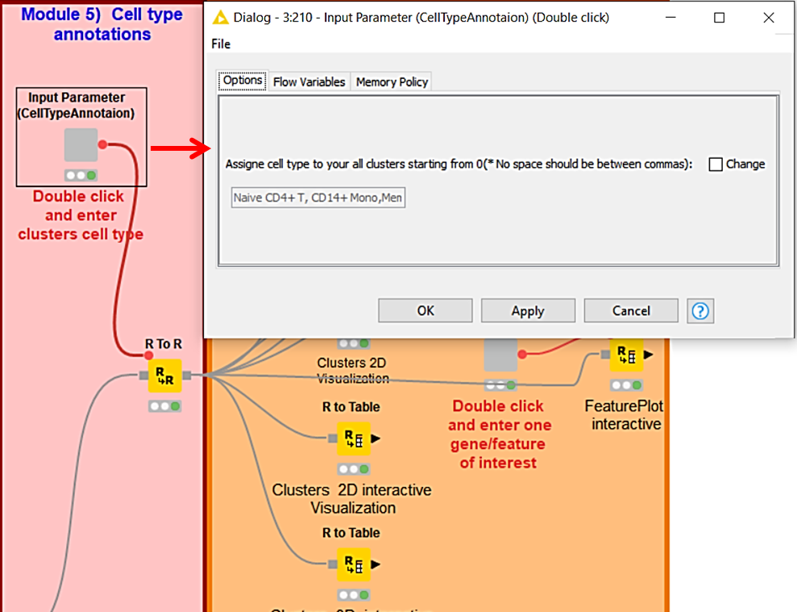

<h1>scRNAseq_KNIME workflow: A Customizable, Locally Executable,
Interactive and Automated KNIME workflow for scRNA seq</h1>

Samina Kausar 1,†, Muhammad Asif 2,†,*, and Anaïs Baudot1,3,4,*

1Aix Marseille Université, INSERM, MMG, Marseille, France,
2Biomedical Data Science Lab, Department of Bioinformatics and
Biotechnology, Government College University Faisalabad, Faisalabad
38000, Pakistan,
3CNRS, Marseille, France,
4Barcelona Supercomputing Center (BSC), Barcelona 08034, Spain.

*Contact:

Anaïs Baudot: anais.baudot@univ-amu.fr

Muhammad Asif: muhasif123@gmail.com; asif.muhammad@gcuf.edu.pk

# scRNAseq_KNIME

Single-cell RNA sequencing (scRNA-seq) captures cellular gene expression at  cell resolution. However, analyzing the resulting scRNA-seq data remains a complex task that requires expertise in biology, statistics, and computer programming. This poses a challenge, as biological experts may lack the necessary data science skills, while bioinformaticians may have limited knowledge of the biology involved, leading to time-consuming iterations.

To address this issue, a user-friendly and customizable workflow that facilitates collaboration between biologists and bioinformaticians is of great interest. Here, we present a locally installable, interactive, and automated workflow, called scRNAseq_KNIME, that enables users to perform the primary steps of scRNA-seq data analysis. The interface features graphical components dedicated to specific tasks, which can be easily modified to suit the user's needs. This workflow is accessible to biologists and serves as a customizable foundation for bioinformaticians.

# Instructions for using the scRNAseq_KNIME workflow

<h2>Outline</h2>

1.  Introduction to KNIME platform
2.  Prerequisites 
3.  Downloading, installing and configuring scRNAseq_KNIME workflow
    for scRNA-seq analysis
4.  Step by step tutorial of scRNAseq_KNIME workflow using the test
    dataset
5.  Frequently Asked Questions (FAQ)

## 1. Introduction to KNIME platform, the Konstanz Information Miner

KNIME (https://www.knime.com/) is an open source platform for data
 analysis, manipulation, and reporting. KNIME aims to advance the
 impact and understanding of data science through visual programming
 using predefined components called <ins>nodes</ins>. **Nodes** are
 basic processing units of KNIME workflows that perform particular
 tasks on data. KNIME Workflows combine different nodes to model the
 data analysis flow. Below are the resources to know more about KNIME
 interface, components and their executions. 
 

Figure 1: KNIME interface with its different sections

 The following are the links to gain more details on KNIME:

-   [KNIME Workbench Guide](https://docs.knime.com/2018-12/analytics_platform_workbench_guide/index.html#workspaces)

-   [KNIME workbench](https://docs.knime.com/2018-12/analytics_platform_workbench_guide/index.html#the-knime-workbench)

-   [KNIME Workspaces](https://docs.knime.com/2018-12/analytics_platform_workbench_guide/index.html#workspaces)
-   [KNIME Nodes](https://docs.knime.com/2018-12/analytics_platform_workbench_guide/index.html#workflow-editor-nodes)
-   [A video to explain workflow and nodes](https://www.youtube.com/watch?v=4rETNe-Xx7k&list=RDCMUCRbKmV_XYB7C12SPBokLVHQ&index=8)

-   [How to Create, Configure, Reset, Execute a Node/group of nodes/full workflow and visualize each node output](https://www.youtube.com/watch?v=fMM_w4v5zZc)

-  [KNIME Analytics Platform Installation Guide](https://docs.knime.com/latest/analytics_platform_installation_guide/index.html#_installing_knime_analytics_platform)

 ## 2. Prerequisites

 ### 2.1 Download R and Rstudio

- [Download and install R](https://cran.r-project.org/)
- [Download and install Rstudio](https://www.rstudio.com/products/rstudio/)
-  [Instructions to install R and Rstudio](https://rstudio-education.github.io/hopr/starting.html)
[Another link](https://techvidvan.com/tutorials/install-r/) 
 

-   Please note that R-4.2.0 version was used for workflow development 

  ### 2.2 Download R packages required for scRNA-seq analysis 

 **Following R packages are required to run the workflow**

-   Rserve
-   Seurat
-   dplyr
-   patchwork
-   ggplot2
-   plotly

 **To install an R package, run the following R functions in the R
 environment or in Rstudio:**

install.packages(\"Rserve\", dependencies = TRUE)
install.packages(\"dplyr\", dependencies = TRUE)
install.packages(\"ggplot2\", dependencies = TRUE)
install.packages(\"patchwork\", dependencies = TRUE)

install.packages(\"Seurat\", dependencies = TRUE)
**NOTE: To install seurat package you may need to install Devlib or
developer libraries. Also,sometimes, seurat installation using
R/Rstudio has issues in linux.**

**In this case you can install seurat using the a command in the
 terminal.**

 **Just run the following commands one by one:**

-   sudo apt-get install build-essential 

-   sudo su - \\ -c \"R -e \\\"install.packages(\'Seurat\', repos=\'[[https://cran.rstudio.com/]](https://cran.rstudio.com/)\')\\\"\"

Installing plotly for R:
install.packages(\'remotes\')
remotes::install_github(\'plotly/plotly.R\')

**To check if all the packages are correctly installed, run the
following R code in R/Rstudio**

library(Rserve)
library(Seurat)
library(dplyr)
library(patchwork)
library(ggplot2)
library(plotly)

**NOTE:  For MacOS, following packages would also be required to run
 the workflow. Run the following function in R/Rstudio**

-   install.packages(\"Cairo\", dependencies = TRUE)

    -   Check if the Cairo package is installed. Run the following R
         code in R/Rstudio

 library(Cairo)

-   On Mac OS X if you use RStudio or R, you must have a copy of
     XQuartz, the X11 window manager, installed. This is no longer a
     default install since Mac OS X 10.8. You need to install XQuartz

-   Please download and install XQuartz from
     [[http://www.xquartz.org/]](http://www.xquartz.org/) 

## 3. Downloading, installing and configuring scRNAseq_KNIME workflow for scRNA-seq analysis

-   **Download KNIME from the following links:**

 [[https://www.knime.com/download-installer/2/64bit]](https://www.knime.com/download-installer/2/64bit)
 (For windows)

 [[https://www.knime.com/download-installer/6/64bit]](https://www.knime.com/download-installer/6/64bit)
 (For Linux)

 [[https://www.knime.com/download-installer/8/64bit]](https://www.knime.com/download-installer/8/64bit)
 (For macOS)

-   **Once downloaded, proceed with installing KNIME Analytics Platform:**

-   Windows: Run the downloaded installer or self-extracting archive. 

-   Linux: Extract the downloaded tarball to a location of your choice.
     Run the KNIME executable to start KNIME Analytics Platform.

-   Mac: Double click the downloaded dmg file and wait for the
     verification to finish. Then move the KNIME icon to Applications.
     Double click the KNIME icon in the list of applications to launch
     KNIME Analytics Platform.

 **Video link** (**installing, launching and defining the working environment**): 
 [[https://www.youtube.com/watch?v=8ISIeFKkoOE]](https://www.youtube.com/watch?v=8ISIeFKkoOE) 

-   **Increase KNIME memory to handle big data and to increase the processing speed** 

1.  Go to KNIME directory (where KNIME is installed)

2.  Open **knime.ini** (configuration settings) file

3.  Increase memory given in MB ( Xmx\...m), where **m** is for **MB** just change number between **Xmx** and **m** (you can increase memory according to your requirements and given computer specifications/capacity)

4.  **Setting up knime.ini:**
     [[https://docs.knime.com/2018-12/analytics_platform_workbench_guide/index.html#setting-up-knime-ini]](https://docs.knime.com/2018-12/analytics_platform_workbench_guide/index.html#setting-up-knime-ini)

-   **Install KNIME extensions**

               Before running the workflow we need to install KNIME extensions. You can   \
               install all the available extensions in the list.  It\'s a simple step follow the    \
               following instructions:

1.  open file -\> install KNIME extensions -\> Select all extensions-\> click Next

-   **Set path to R:**

1.  Run following function in R/Rstudio to find the path to R home

             R.home() 

2.  Open file -\> preferences -\> KNIME -\> R (Browse R directory (path
    to the folder where R is Installed)). For example in R/RStudio on
    Linux, R.home() function returns path to R is
    [\"/usr/lib/R\"]

 **NOTE: Make sure path is set to R home where all packages were installed**

-   **Import workflow**

 Open file -\> Import KNIME Workflow -\> select file (Browse the
 **scRNAseq_KNIME_workflow.knwf** file) .knwf is file extension to
 specify KNIME workflow

 **Video link (How to import and export KNIME Workflows):**

  [[https://www.youtube.com/watch?v=4GiwmM-qcC4]](https://www.youtube.com/watch?v=4GiwmM-qcC4) 

## 4. Step by step tutorial using the test dataset

-   **Download test dataset: Peripheral Blood Mononuclear Cells (PBMC)**

 Raw data of PBMCs that have 2700 single cells was downloaded from
 [[https://cf.10xgenomics.com/samples/cell/pbmc3k/pbmc3k_filtered_gene_bc_matrices.tar.gz]](https://cf.10xgenomics.com/samples/cell/pbmc3k/pbmc3k_filtered_gene_bc_matrices.tar.gz)  

 It can also be download from
 [[https://satijalab.org/seurat/articles/pbmc3k_tutorial.html]](https://satijalab.org/seurat/articles/pbmc3k_tutorial.html) 
 Three input files (barcodes.tsv, genes.tsv, matrix.mxt) were extracted
 into an input data directory **"PBMC_filtered_gene_bc_matrices"** (Figure 2).

  Figure 2:  Input data directory

-   **Create a working directory to use as KNIME workspace**

 Generate a folder (directory) containing three of your input data
 files and scRNAseq_KNIME workflow. For this tutorial we generated a
 directory named as "scRNAseq_KNIME workflow  guide". This directory
 has: a) **input data directory** (see Figure 2), b) **output directory** that is required to save all the generated outputs of the
 scRNAseq_KNIME workflow, and c) the provided file of workflow
 "**scRNAseq_KNIME_workflow.knwf**" (see Figure 3).

Figure 3: Steps to generate KNIME workspace to open scRNAseq_KNIME
workflow. 

-   **Import scRNAseq_KNIME workflow into KNIME workspace**

 After selecting the working directory as KNIME workspace (see Figure
 3) all data of the working directory will be in the KNIME local
 workspace (See Figure 4). Please follow the following steps to import
 scRNAseq_KNIME workflow from the **scRNAseq_KNIME_workflow.knwf**
 compressed file into KNIME workspace (Figure 4).

 Right click on the **scRNAseq_KNIME_workflow.knwf**  present in KNIME
 local workspace =\> click on "Import KNIME Workflow" option =\> Browse
 the workflow file and press Finish. 

Figure 4: Steps to import KNIME workflow

-   **Open scRNAseq_KNIME workflow in KNIME workbench**

 scRNAseq_KNIME workflow imported file will appear in the local
 workspace of KNIME. Just right click and open the scRNAseq_KNIME
 workflow. Workflow will appear in KNIME workbench where you can
 configure and execute it to perform scRNA-seq analysis (Figure 5).

Figure 5: Guide to open scRNAseq_KNIME workflow in KNIME workbench

-   **Overview of the scRNAseq_KNIME workflow**

 scRNAseq_KNIME workflow consists of 6 modules that include all of the
 main steps required for scRNA-seq data analysis. Specific input
 parameters are required for each module to perform the relevant task.
 I The details of input parameters and outputs of each module is
 provided below separately  (Figure 6).

Figure 6: Overview of the scRNAseq_KNIME workflow

-   **Module 1: Input and quality control (QC)**
 Module 1 has two input parameters nodes where users need to define input options to read input data from users defined input data directory and then quality control is performed using different parameters (Figure 7). 

Figure 7: Module 1: Input and quality control (QC) 

**"Input Parameters" (1) description:**

 This input parameters node requires users to define the three inputs that are necessary for workflow to define directory to automatically save all the outputs, to define file names and to get input data (Figure 8). Description for each input option is defined below.

**Insert path of workplace/directory to save outputs from workflow:**

 This flow variable defines the path of the working directory to save
 all outputs from scRNAseq_KNIME workflow.

**Write the project name that will appear in all graphics to label data:**

 This flow variables defines the project name

**Insert path of the directory that have three input data files:**

 This flow variable defines the path of the working directory to read
 input data files (matrix, barcodes, and genes) to create a Seurat
 object.

                 **Note:** <ins> The description of each input parameters node can be seen on the side description window of the scRNAseq_KNIME workflow within KNIME workbench. To visualizethe description of each node, first select the relevant node and then see their description.</ins>
                 

Figure 8:  **Input Parameters (1)**
 
**"Input Parameters (QC filters users defined values)" (2) description:**
 This input parameters node requires quality control filters that need to process the given dataset. Description of the available filters is given below. By default provided values   can be changed according to datasets under analysis. It is suggested to visualize QC plots with default values before setting and applying the altered values for QC filters (Figure 9).

**Min cut off nFeature_RNA (filter cells that have unique feature counts less than users defined cut off):** 
 By default scRNAseq_KNIME workflow filters cells expressing less than 200 nFeature_RNA (genes) or  cells that have unique feature counts less than 200 or users defined cutoff.

**Max cut off (% mitochondrial counts):**
 By default scRNAseq_KNIME workflow filters cells that have \>5% mitochondrial counts.

**Max cutoff nFeature_RNA (filter cells that have unique feature higher than users defined cut off):** 
 By default scRNAseq_KNIME workflow filter cells expressing less than 200 nFeature_RNA (genes) or cells that have unique feature counts higher than 2500 or users defined cutoff. 

**Max cut off (% ribosomal counts):**
 Choose an appropriate value according to data

                  **Note:** <ins> The description of each input parameters node can be seen on the side description window of the scRNAseq_KNIME workflow within KNIME workbench. To visualizethe description of each node, first select the relevant node and then see their description.</ins>

 

Figure 9:   Input Parameters (QC filters users defined values)

 
**Calculate the percentage of the mitochondrial and ribosomal genes:**
 The mitochondrial and ribosomal genes pattern used in the workflow works for human gene names. The user may need to adjust gene naming pattern  depending on your organism of interest. If you weren't using gene names as the gene ID, then this function wouldn't work. The guidance about how users can edit this pattern is provided within the module 1 that can be seen in the mouse over effect of the **"R Source(workspace)"** nodes before and after applying filters (Figure 10). Please see the diagram below.

Figure 10:  Mouse over effect to guide users to edit mitochondrial and
ribosomal genes pattern 

**Outputs of the module 1:**
 Execute all nodes in module 1. When the status of each node is green.
 You can see output of each node will be saved in the user\'s defined
 output directory. You can also right click on each node and see the
 output generated from each node. Please see diagrams below for all the
 generated outputs of module 1 (Figure 11-13).

Figure 11: Guide to see the output of a node

Figure 12: Output plots generated in the module 1: QC graphs before
applying filters

Figure 13: Output plots generated in the module 1. QC graphs after
applying filters

-   **Module 2:Data normalization and denoising. Selecting highly variable genes**

 This module performs data normalization and the denoising to prepare
 data for further analysis and identifies highly variable features.
 Module 2 has one "Input Parameters" node that provides a choice of
 available statistical methods to infer highly variable genes (HVG) in
 the filtered data (Figure 14). Description of each selection method
 can be seen in the side description window of the KNIME workbench.
 Output of this module is a plot of top 2000 HVG (Figure 14).  

Figure 14: Module 2: ) Data normalization and denoising. Selecting
highly variable genes.

-   **Module 3: Dimension reduction and clustering**

 The dimension reduction and clustering module allows users to apply
 linear and nonlinear dimension reduction (DR) approaches, followed by
 clustering of cells (Figure 15). This module has two input parameters
 nodes. Fist input parameter node "Input PCA dim." asks for selection
 of the number of PCA dimensions to perform clustering on reduced
 dimensions. Usually, the decision of choosing the number of PCA
 components for clustering is made after visualizing the Elbow plot
 that is generated in this module. Elbow plot helps to find the optimal
 number of PCA components that capture the maximum variance. For the
 given test data we selected 10 PCA components to perform the
 clustering. 

 Second input parameter node "Input Parameters (Clustering + DR)" 
 requires the selection of non-linear DR algorithms and also the
 clustering parameters (Figure 15). Description of each given input
 option in the both input parameters nodes can be seen in the
 description window of KNIME workbench. Please first select the
 relevant node to see their description.  Output of this module is a
 two dimensional visualization plot of the identified clusters (Figure
 15). 

Figure 15: Module 3: Dimension reduction and clustering

-   **Module 4:  Clusters analysis**

 This module provides options for various statistical tests that can be
 applied on identified clusters. Statistical analysis of clusters helps
 to infer biologically important genes that define the type of a
 cluster (Figure 16). Cluster marker module has two sections (4A) and
 (4B) The first section (4A)  finds markers (DEG: differentially
 expressed genes) for each cluster in the dataset. The second section
 (4B) finds markers for selected clusters of interest that means the
 user can apply DEA on the selected group of clusters. This module has
 3 input parameters nodes to take input for DEA (Figure 16). One input
 parameter node is specified for the selection of parameters for
 section (4A)  and other two input parameters nodes are required for
 section (4B). Input options are shown in figure 16 for each node.
 Detailed description of each of these input parameter nodes and all
 available parameters options can be seen in the description window of
 KNIME workbench within the workflow. 

Figure 16: Module 4: Clusters analysis. 4A)
FindAllMarkers: finds markers (differentially expressed genes) for each
of the clusters in the dataset, and 4B) FindMarkers: finds markers
(differentially expressed genes) for selected clusters of interest

**Output of the module 4:**
 Each section (4A) and (4B) generate three output tables including a)
 "All DE genes", b) "Top 20 DE genes" and c) "Top 5 DE genes"
 containing the information about DEG (Figure 17 ) and two plots
 heatmap and dotplots (Figure 18).

Figure 17: Module 4: output tables of differentially expressed genes 

Figure 18: Module 4: output plots of differentially expressed genes 

-   **Module 5:  Cell type annotation**

 This module has one input parameter node that allows the user to
 assign the cell type of each cluster by defining the name of each
 cluster (Figure 19). Please observe the total number of the clusters
 and assign names to each one to avoid any error. By default option is
 set according to the test dataset. 

Figure 19: Module 5:  Cell type annotations

-   **Module 6:  Visualization**
 This module allows to visualize their data in different plots
 including VlnPlot, FeaturePlot, DotPlot, clusters 2D/3D interactive
 visualization (plotly), interactive FeaturePlot (plotly). This module has two input parameters nodes that
 ask users to define a set of features or genes to visualize them in
 different plot options (Figure 20).  By default option is set
 according to the test dataset. 

Figure 20: Module 6:  User defined visualization

**Outputs of the module 6:**
 Execute all nodes in module 6. When the status of each node is green.
 You can see output of each node will be saved in the user\'s defined
 output directory. The output of the interactive visualization can only
 be seen in the saved html files. For all other plots you can right
 click on each node, open the option "Image output" and see the output
 generated from each node. All graphics will also be saved in the
 user\'s defined output directory. Please see images below for all the
 generated outputs of module 6 (Figure 21-27).

Figure 21: Output of module 6:  VlnPlot of the selected set of genes
(*MS4A1, CD79A, GNLY, CD3E*) in the test dataset PBMCs

Figure 22: Output of module 6:  FeaturePlot of the selected set of genes
(*MS4A1, CD79A, GNLY, CD3E*) in the test dataset PBMCs

Figure 23: Output of module 6:  DotPlot of the selected set of genes
(*MS4A1, CD79A, GNLY, CD3E*) in the test dataset PBMCs

Figure 24: Output of module 6:  Clusters 2D visualization of the test
dataset after cell type annotations

Figure 25: Output of module 6:  Clusters 2D interactive visualization

Figure 26: Output of module 6: Clusters 3D interactive visualization

Figure 27: Output of module 6: FeaturePlot interactive of a selected
gene *MS4A1* in the test dataset PBMCs

## 5. Frequently Asked Questions (FAQ)

-   **What is scRNA?**

 Single-cell RNA sequencing (scRNA-seq) measures the gene expression in
 individual cells in a sample. 

-   **What is KNIME?**

 KNIME is a free and open source data analysis framework that allows
 the creation of reusable workflows for big data analysis and
 visualization. 

-   **What is Seurat?**

 Seurat is an R package designed to perform all the necessary tasks for
 the analysis of scRNA-seq data.

-   **What does KNIME workflow for scRNA do? Or What are the applications of the presented workflow?**
 scRNAse_KNIME workflow is a locally installable, user-friendly, interactive and automated workflow, to analyze scRNA-seq data. The interface is composed of graphical entities called nodes dedicated to specific and modifiable tasks. This workflow allows users to perform main components of scRNA-seq data analysis. It can easily be used by biologists, and can also serve as a basis to be customized for bioinformaticians. 

-   **How to install the workflow?**
 Please see the section: "<ins>Downloading, installing and configuring scRNAseq_KNIME workflow for scRNA-seq analysis]</ins> "
 
 Please see the section: "<ins>Step by step tutorial using the test dataset</ins> " 

-   **How do I install R?**
 Please see the sections:
 
 <ins> Download R and Rstudio</ins>
 <ins>Download R packages required for scRNA-seq analysis</ins>

-   **How do I install KNIME?**
 Please see the sections: 
 "<ins>Downloading, installing and configuring scRNAseq_KNIME workflow for scRNA-seq analysis</ins>"
 <ins>KNIME Analytics Platform Installation Guide:</ins>
 [[https://docs.knime.com/latest/analytics_platform_installation_guide/index.html#\_installing_knime_analytics_platform]](https://docs.knime.com/latest/analytics_platform_installation_guide/index.html#_installing_knime_analytics_platform) 

-   **How do I create a KNIME workspace?**

 Please see the section: "<ins> Create a working directory to use as KNIME workspace</ins>"

-   **How do I open KNIME workspace?**

 After selecting a workspace for the current project, click Launch. The KNIME Analytics Platform user interface - the KNIME Workbench - opens.
 
 Please see the sections:
  
 "<ins>Create a working directory to use as KNIME workspace</ins>"
 "<ins>Introduction to KNIME platform</ins>"
 <ins> KNIME Workspaces:</ins>
 [[https://docs.knime.com/2018-12/analytics_platform_workbench_guide/index.html#workspaces]](https://docs.knime.com/201812/analytics_platform_workbench_guide/index.html#workspaces) 
 <ins>See KNIME Workbench Guide:</ins>
 [[https://docs.knime.com/2018-12/analytics_platform_workbench_guide/index.html#workspaces]](https://docs.knime.com/201812/analytics_platform_workbench_guide/index.html#workspaces)

-   **How do I change/switch my KNIME workplace?.**

 You can switch to a different workspace while you are running KNIME by
 choosing File → Switch Workspace. This is the normal mechanism in
 KNIME for switching workspaces.

-   **Can I open multiple KNIME workspaces at the same time?**

 On a local workspace they can be stored in folders. Locally there can
 only be one workspace opened and used at a time.

-   **Can I use it to analyze any scRNA dataset?**

 scRNAseq_KINME workflow is developed to assist biologists and bioinformaticians to perform scRNAseq data analysis in an
interactive and quick way. scRNAseq_KNIME workflow can be used to analyze any single cell RNA seq. data set as long as it consists of three files **(feature, expression matrix and barcodes containing files)**.

**What are the hardware requirements to install and run this workflow?**

 KNIME installation required to run the scRNAseq_KNIME workflow. To
 analyze scRNA-seq data, the recommended hardware requirement is a
 64-bit operating system with at least 32GB RAM and 8 CPU cores as
 minimum. Please contact KNIME for sizing help.

 The folder, that will be created during the installation process,
 should exist on a local drive and have enough free space to store the
 workflows and jobs. We recommend a minimum of 250 GB, although this
 may need to be increased considerably depending on the intended use
 case.

 <ins>See KNIME Analytics Platform Installation Guide:</ins>

 [[https://docs.knime.com/latest/analytics_platform_installation_guide/index.html#\_installing_knime_analytics_platform]](https://docs.knime.com/latest/analytics_platform_installation_guide/index.html#_installing_knime_analytics_platform) 

 See KNIME Server Installation Guide: 

 [[https://docs.knime.com/2020-12/server_installation_guide/index.html#\_introduction]](https://docs.knime.com/2020-12/server_installation_guide/index.html#_introduction) 

-   **Where to start the analysis?**

 Please see the section: "<ins>Step by step tutorial using the test dataset</ins>"

-   **Where can I find the help for workflow installation?**

 Please see the sections: 
 
 "<ins>Downloading, installing and configuring scRNAseq_KNIME workflow for scRNA-seq analysis </ins>"
 
 "<ins>Step by step tutorial using the test dataset </ins>"

-   **Is there any case study?**

 Yes. Please see the section: "<ins>Step by step tutorial using the test dataset</ins> "

-   **How can I cite the workflow?**
